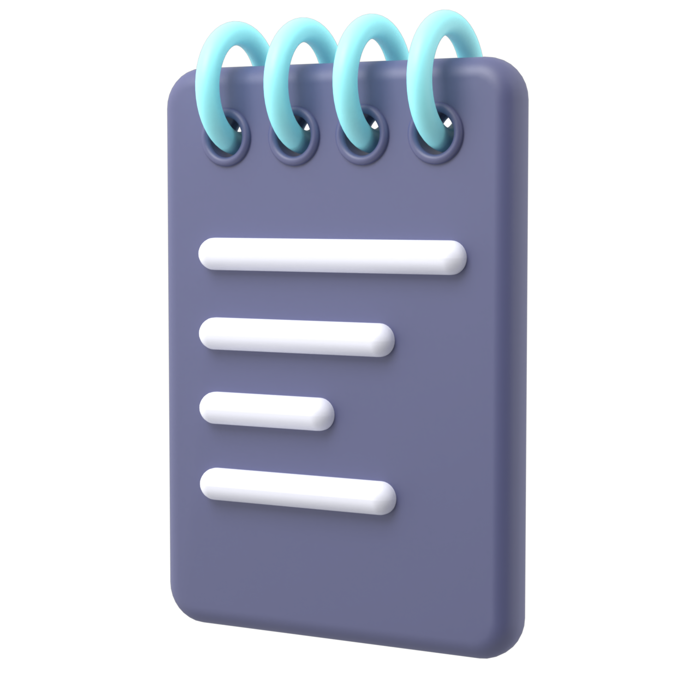

#### Noter

<div align="center">
  

## [Noter](https://neog-noter.netlify.app/)

Note Taking App


</div>

---

## Quick Start

Preview Link : https://neog-noter.netlify.app

## Run Locally

Clone the project

```bash
  git clone https://github.com/nerdyspook/noter.git
```

Go to the project directory

```bash
  cd noter
```

Install dependencies

```bash
  yarn install
```

Start the server

```bash
  yarn start
```

---

## Pages Included

-   Home Page
-   Notes Page
-   Labels Page
-   Archive Page
-   Trash Page
-   User Details Page

---

## Features Included

-   Authentication:
    -   User Signup
    -   User Login
-   Notes Page
    -   Add a Note
    -   Update a Note
    -   Delete Note
-   Filter by Label Page
-   Search Note by Title
-   Archives
    -   Add note to Archive
    -   Restore note from Archive
    -   Delete note from Archive
-   Pin / Unpin a note
-   Trash Page
    -   Restore from Trash
    -   Delete from Trash Permanently

---

## Tech Stack

-   [React JS](https://reactjs.org/)
-   [React Router v6](https://reactrouter.com/)
-   [Kal-UI Component Library](https://kal-ui.netlify.app/)
-   [SASS](https://sass-lang.com/)

---

## Demo


